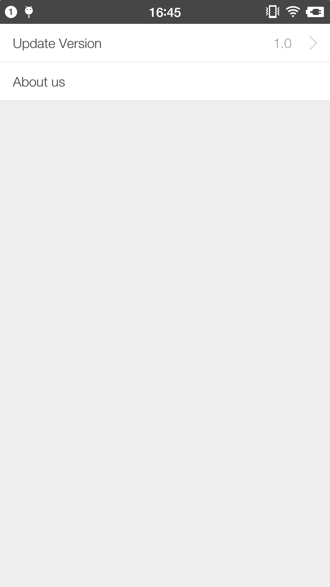

## react-native-tab-button

### Installation
```
npm install react-native-tab-button --save
```

### Usage
#### base
``` js
import TabButton from 'react-native-tab-button';

class AwesomeProject extends Component {
  render() {
    return (
        <View>
            <TabButton leftLabel="Update Version" onPress={this._doUpgrade} rightLabel="1.0" />
            <TabButton leftLabel="About us" />
        </View>
    );
  }
  _doUpgrade() {
      console.log("do upgrade");
  }
}
```
#### custom style
``` js
import { StyleSheet } from 'react-native';

const mystyle = StyleSheet.create({
    leftLabel: {
        flex: 1,
        fontSize: 22,
        color: "red",
        paddingLeft: 18
    },
});

export default mystyle;
```

``` js
import mystyle from './mystyle';
<TabButton leftLabel="About us" customStyle={mystyle}/>
```

View demo folder for more details.

### Demo
<!---->


### License
Apache License V2
